# CurrentNews365 – MERN News Platform

**CurrentNews365** is a full-stack MERN-based news publishing platform that delivers
real-time news articles with SEO optimization, dynamic sitemap generation, and a modern SPA frontend.

🔗 **Live Website:** https://www.currentnews365.com  
🔗 **Backend API:** https://currentnews365-backend.onrender.com  

## Features

- Dynamic news publishing system
- Search, categories, tags & trending news
- Dark / Light mode
- Fast SPA frontend (Vite + React)
- SEO optimized (meta tags, canonical URLs, schema)
- Dynamic sitemap.xml generation
- RSS feed for news syndication
- View-based trending & popular articles
- Admin-ready backend architecture

## Tech Stack

### Frontend
- React + Vite
- Tailwind CSS
- React Router
- Framer Motion
- React Helmet (SEO)

### Backend
- Node.js
- Express.js
- MongoDB + Mongoose
- Dynamic sitemap & RSS generation

### Deployment
- **Frontend:** Vercel
- **Backend:** Render

## SEO & Indexing

- Sitemap: `/sitemap.xml`
- RSS Feed: `/rss.xml`
- robots.txt configured
- Canonical URLs implemented
- Google Search Console integrated

## Project Status

- Fully deployed  
- SEO-ready  
- Production-grade  
- Portfolio project

## Screenshots

### Frontend (Public Website)

**Homepage**
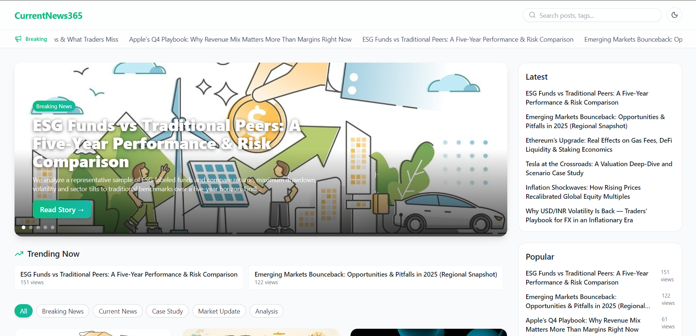
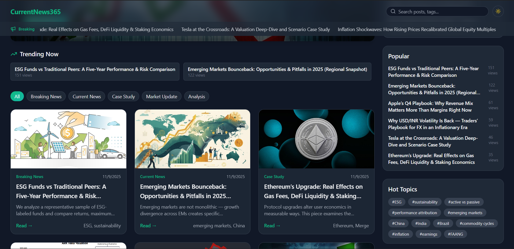
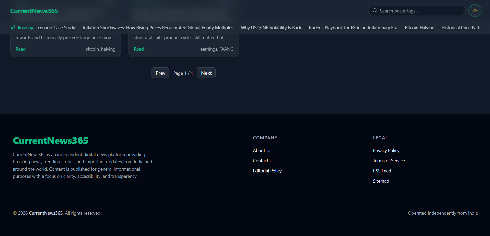

**Dark Mode**
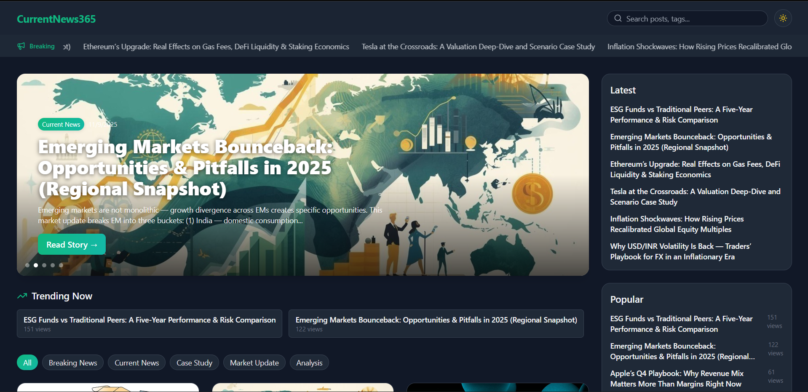

**Article / Post Detail Page**
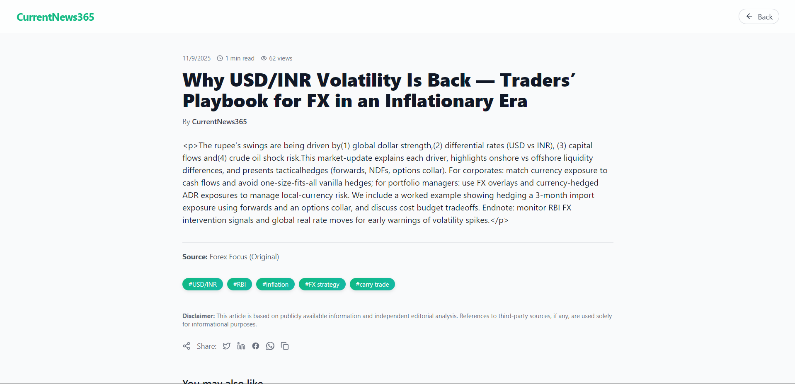

**Mobile View**
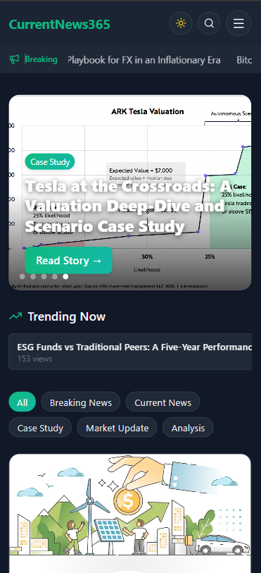
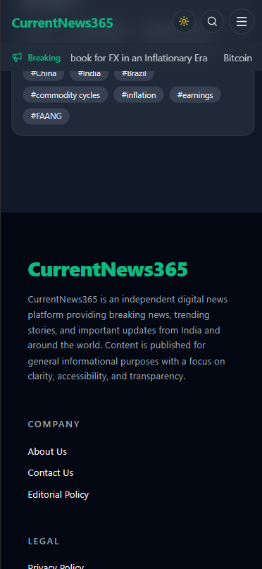

### Admin Panel (Demo Screenshots)

> ⚠️ **Note:**  
> The admin panel screenshots shown below use **anonymized demo data**.  
> No client-sensitive information is exposed.

**Admin Dashboard**
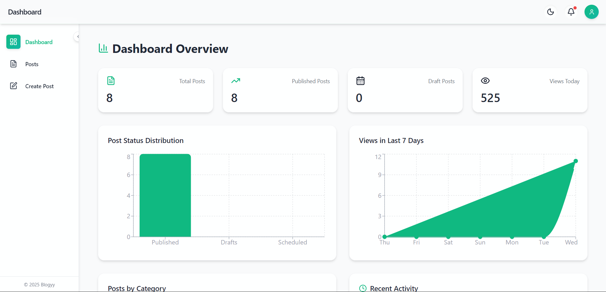

**Admin Panel – Mobile View**
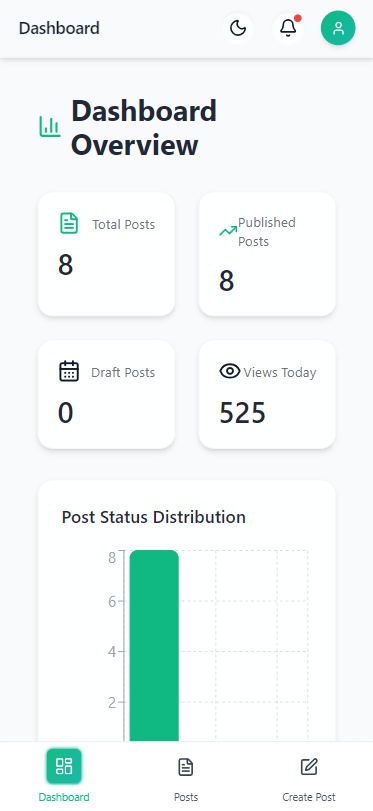

**Post Management**
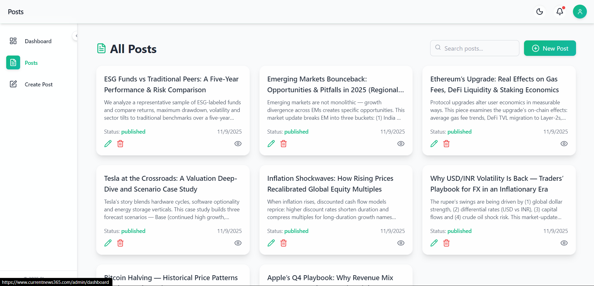

**Post Editor**
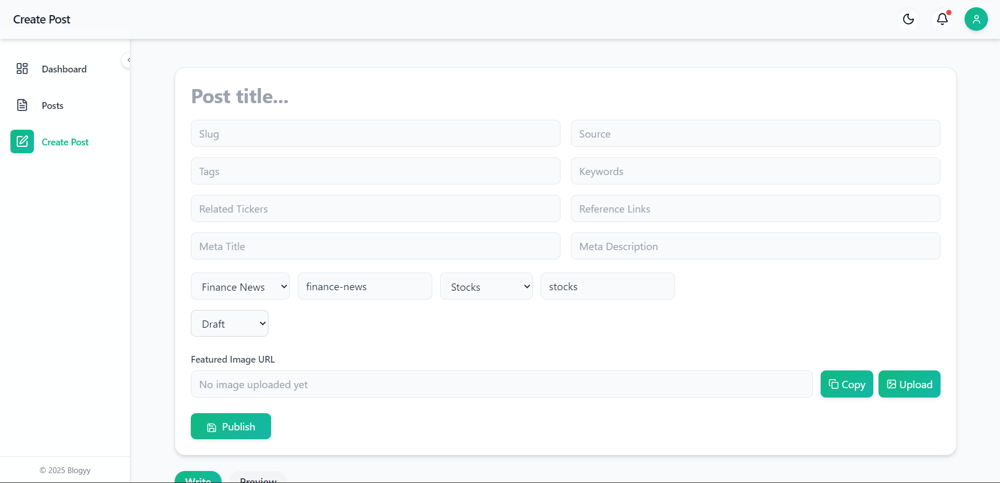
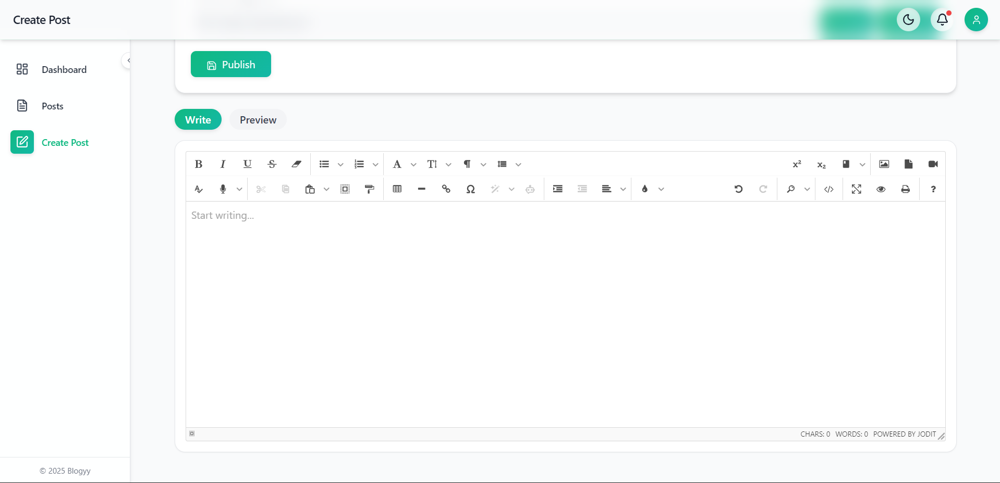

## Author

**Jaydeep Sadhu**  
Full Stack Developer (MERN)

Feel free to explore, fork, or provide feedback!

